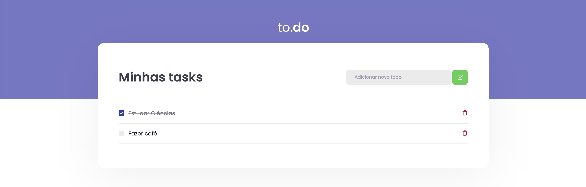

<div align="center">
  
</div>

<p align="center"> This is an app that you can control your activities. Add or remove items, and check those are completed. </p>

<p align="center">
 <a href="#objective">Objective</a> •
 <a href="#technologies">Technologies</a> • 
 <a href="#features">Features</a> • 
 <a href="#usage">Usage</a> • 
 <a href="#contribution">Contribution</a> • 
 <a href="#author">Author</a> • 
 <a href="#license">License</a>
</p>

I needed to develop this app for a challenge, that was received in the Ignite course, promoted by Rocketseat. I have to apply React Hooks, like useState and useEffect.



<h2 id="objective">🎯 Objective</h2>

A simple app to you organize your objectives and check when you can done one or more. Separate your tasks in many of others simple tasks. 

<h2 id="technologies">🛠 Technologies </h2>

- [ReactJS](https://reactjs.org)
- [Typescript](https://www.typescriptlang.org/)
- [WebPack](https://webpack.js.org/)
- [Babel](https://babeljs.io/)
- React Hooks: useState and useEffect

<h2 id="features">🚀 Features</h2>

- Add new To-do's
- Remove To-do's
- Check or uncheck To-do's as concluded
- Storage To-do's on localstorage
- Get To-do's from localstorage when users get out and return to the page

<h2 id="usage">👷 Usage </h2>

Required! Install git, node and yarn (or npm).

```bash
# Clone Repository
$ git clone https://github.com/Guillescas/todo-app

# Go to server folder
$ cd todo-app

# Install Dependencies
$ yarn

# Run Aplication
$ yarn dev

# Access localhost
http://localhost:8080
```
<h2 id="contribution">🤝 Contribution</h2>

This project is for study purposes too, so send me an email telling me what you are doing and why you are doing it, teach me what you know. All kinds of contributions are very welcome and appreciated!

<h2 id="author">💻 Author </h2>


By Guilherme Illescas. You can find me in:

[](https://www.linkedin.com/in/guilherme-illescas/)
[](mailto:oi@guilhermeillescas.dev)

<h2 id="license">📝 License</h2>
You can copy and edit this project. Enjoy :)